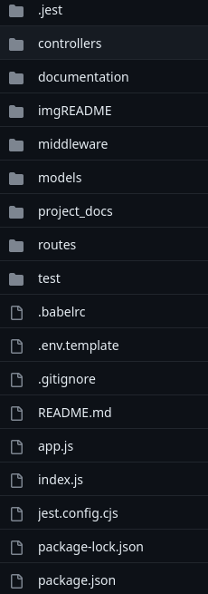

# SliceIT

## Table of Contents
- [SliceIT](#sliceit)
  - [Table of Contents](#table-of-contents)
  - [Descrizione](#descrizione)
  - [Sviluppato da](#sviluppato-da)
  - [Project structure](#project-structure)
  - [How to run](#how-to-run)
  - [Deploy](#deploy)
  - [Documentazione](#documentazione)
  - [Note](#note)
  - [Future works](#future-works)

## Descrizione 
SliceIT è un servizio web per la gestione semplificata di spese condivise sviluppato per il corso Ingegneria del software all'università di Trento. L'obiettivo del software è di semplificare la gestione delle spese condivise. Questo ti permetterà di creare un gruppo di spesa con i tuoi amici e condividere le spese con loro. La visualizzazione di debiti e crediti sarà immediata. Un grafico di resoconto delle spese aiuterà l'utente nel capire le categorie di spese fatte. Questa repository contiene il backend, se interessati al frontend la repository è https://github.com/davidedema/sliceIT-frontend

## Sviluppato da
- Davide De Martini @davidedema
- Francesco Poinelli @Vitho306
- Riccardo Stiz @Rikistiz

## Project structure


- **controllers** : Contiene l'implementazione delle apis
- **middleware** : Contiene il middleware, nel nostro caso il codice per verificare il toke jwt
- **models** : Contiene i modelli mongoose per interfacciarsi al database
- **routes** : Contiene le rotte e la documentazione della nostra applicazione
- **test** : Contiene gli script di test scritti con jest
- **documentation** : Contiene i file `.yaml` per la documentazione
- **project_docs** : Contiene i documenti scritti durante tutto il corso e i vari backlog
- .env.template : template per il file `.env` 
- app.js : Contiene i setting iniziali del nostro servizio web
- index.js : Entrypoint della nostra applicazione


Tutti gli altri file sono file di setup secondari.


## How to run
1) Per provare il progetto assicurarsi di avere nodejs (> v. 20.0.2) e npm installati. Per ubuntu:
``` BASH
sudo apt install nodejs
sudo apt install npm
```
2) Clonare il progetto nel posto desiderato
```BASH
git clone https://github.com/davidedema/sliceIT-backend.git
```
3) Ora aggiornare le dipendenze
```BASH
cd sliceIT-backend
npm install
```
4) Creare il proprio file `.env`
```
touch .env
```
Copiare il template e inserire le variabili d'ambiente (bisognerà creare la propria istanza di database su https://www.mongodb.com)

5) Fatto questo passo basterà runnare il server e il servizio sarà in funzione
```BASH
npm run dev
```
## Deploy
Il servizio è anche raggiungibile all'indirizzo https://www.sliceit-be.onrender.com

## Documentazione
La documentazione tramite swagger è accessibile in due modi. O facendo partire il server locale e andando all'indirizzo http://localhost:3001/api/v1/docs oppure andando all'indirizzo https://www.sliceit-be.onrender.com/api/v1/docs

## Note
Il progetto è completo se si usa anche l'interfaccia grafica creata. Consigliamo vivamente di usarla per avere un esperienza completa. Essa è reperibile al link: https://github.com/davidedema/sliceIT-frontend. Seguire il README per l'istallazione.

Ricordimao che il progetto non è stato sviluppato nella sua interezza. Per esempio manca la feature di pagare la spesa che era riservata a uno sprint successivo.

## Future works
Nel futuro vogliamo sviluppare queste funzionalità tra cui c'è la gestione delle FAQ, la possibilità di pagare una spesa e infine la possibilità di notificare un debitore del proprio debito. Inoltre ci riserveremo anche di risolvere potenziali nuovi bug e bug noti, migliorare l'interfaccia utente e sviluppare nuove funzionalità.